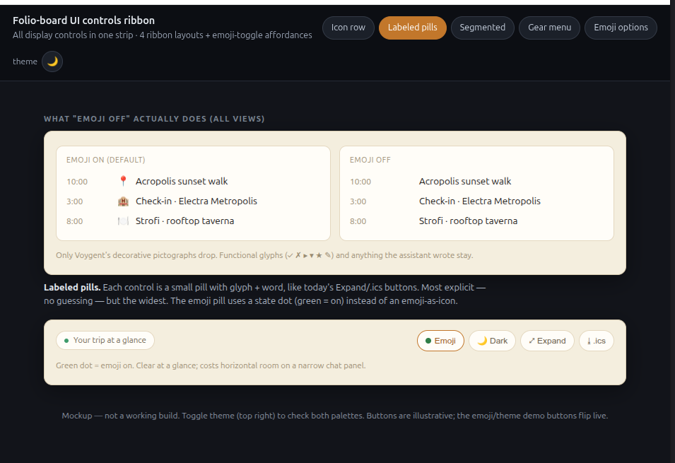

# mock — build and share UI design variations

Turn a rough idea or an existing interface into a **single self-contained HTML
file** holding several design variations behind a top view-switcher, then get it
in front of someone. The whole point is speed and low ceremony: don't
over-interview, infer sensible defaults and confirm in one pass.



*(The example above is what a finished mock looks like — one HTML file, the tabs
top-right flip between variations. Everything is inline, so it renders the same
opened from disk, as an email attachment, or at a URL with no network.)*

## Mode: build-only vs. publish

If the user asks for **build-only** — `/mock --local`, "just build the file",
"build only", "don't publish", "no public link" — do Steps 1–2, skip the publish
path (3A), and deliver via download and/or email only (3B/3C). This is the right
default when there's no static host wired up or no need for a shareable URL.

## Step 1 — short interview

Ask only what you can't reasonably infer. Batch these (skip any the user already
answered in their prompt):

1. **What are we mocking?** A screen/component/page — describe it, or point at a
   reference: an existing file in the repo, a URL, a pasted screenshot, or a
   verbal description. If it's an existing surface, pull the real markup as the
   starting point.
2. **How many variations, and what varies between them?** e.g. 3 variations of
   layout; or the same layout in 3 color directions; or 2 copy/density
   treatments. Name the dimension so each variation is a deliberate point in that
   space, not a random reshuffle.
3. **Style direction / constraints?** Brand-aligned vs. exploratory; light/dark;
   desktop vs. mobile-first; any must-keep elements.
4. **Where does it need to go?** Download / email / public link (can be more than
   one), or build-only. If the user already signalled build-only, don't ask.

If the opening message gave enough, skip straight to building and state the
assumptions you're running with.

## Step 2 — build the self-contained HTML

Start from `template.html` in this skill directory — it already implements the
view-switcher (tablist + URL-hash deep-linking) with **zero external
dependencies**. Copy it to a working file and fill it in.

Hard rules for the file:
- **Fully self-contained.** Inline all CSS and JS. No external stylesheets,
  fonts, scripts, or remote images. For imagery use CSS, inline SVG, or `data:`
  URIs. The file must render correctly opened from disk, as an email attachment,
  and at a URL with no network.
- **One file, N variations.** Each variation is a `<section class="view"
  id="...">` toggled by a matching `.vbtn`. Scope every variation's CSS under its
  `#id` so variations can't bleed into each other.
- **Each variation is a real point in the named dimension** from Step 1 — make
  the differences obvious and labelled.
- **Label it a mockup**, not a working build (the template footer does this).
- Make it responsive enough to review on a phone.
- **Don't emit AI-default design.** Before writing styles, invoke the companion
  **`unslop-ui`** skill (build mode) and make deliberate, non-default choices for
  color, type, radius, gradients, and layout. Concretely: no "AI purple"
  (indigo/violet/`#6366f1`-family) as primary, no gradient-filled heading text,
  no Inter/Geist/Roboto as the only font, no emoji-as-icons, no centered-hero +
  three-feature-card skeleton unless that *is* the point. (Skip this only when a
  variation is *deliberately* the AI-default look for comparison.)

Write the file somewhere temporary, e.g. `/tmp/mock-<slug>.html`. Pick a short
kebab-case **slug** (`[a-z0-9-]`, ≤64 chars).

Before sharing, sanity-check the file opens and the switcher works (e.g. grep
that every `data-view` has a matching `id`).

**De-AI scan gate.** Run the `unslop-ui` scanner over the file and skim the
result before delivering:

```bash
python3 ~/.claude/skills/unslop-ui/scripts/devibe_scan.py /tmp/mock-<slug>.html
```

It's stdlib Python, read-only, zero install. If it reports HIGH findings or a
"STRONG AI-default look" verdict, fix them (the scanner prints the fix per tell)
before you deliver — unless the AI-default look is intentional for a comparison
variation. Mention the vibe score in your delivery summary so the user knows it
was checked. Layout/motion tells a regex can't see still need your eyes.

## Step 3 — deliver

Do whatever the user asked for in Step 1.4. The paths are independent; combine as
needed.

### A) Publish to a URL (optional — needs your own static host)

There's no host bundled with this skill. If you have a static host that accepts
an authenticated upload (an S3/R2 bucket, a small Worker/route, a `scp` target),
publishing a mock is a one-file PUT/copy of `/tmp/mock-<slug>.html` to
`.../mocks/<slug>.html`. Doing it as a plain authenticated HTTP PUT keeps it
working from a remote session or a desktop app with no cloud-provider CLI or API
token in the loop.

Give the user the resulting URL. A specific variation deep-links by appending
`#v2` etc. Skip this path entirely if no host is configured — download and email
cover most cases.

### B) Email it (draft)

If a mail integration is available (e.g. a Gmail MCP `create_draft` tool), create
a **draft** (never auto-send) the user can review:
- Attach the HTML file (base64-encoded; `mimeType: "text/html"`,
  `filename: "<slug>.html"`).
- If you published a URL in path A, include it in the body too — some mail
  clients won't render an HTML attachment inline, so the link is the reliable
  viewing path.
- Ask for recipient(s) and a subject if not given; leave `to` filled but let the
  user confirm before sending.

### C) Download / present the file

Surface `/tmp/mock-<slug>.html` to the user for download. This is the right path
when there's no recipient and no need for a URL.

## Notes

- This skill is for **throwaway design exploration**, not production rendering.
  It deliberately carries no data identity, branding, or wire contracts.
- Keep slugs descriptive and collision-resistant (`plan-picker-v2`) if you share
  a `mocks/` namespace across a team.
